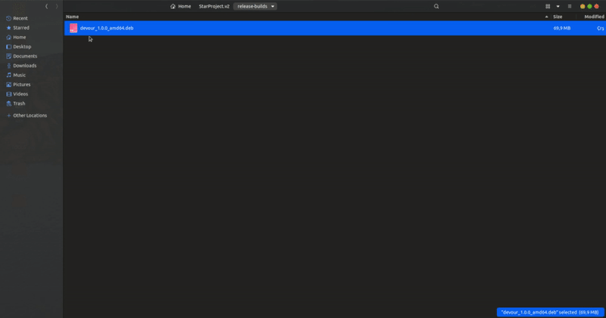
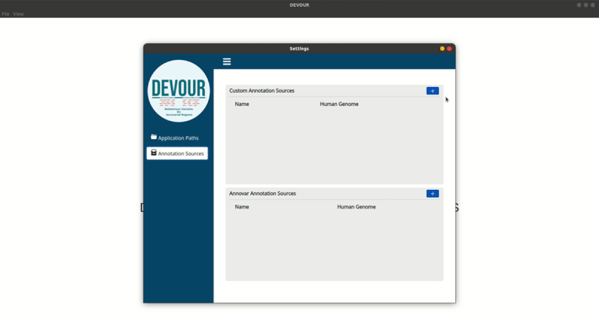
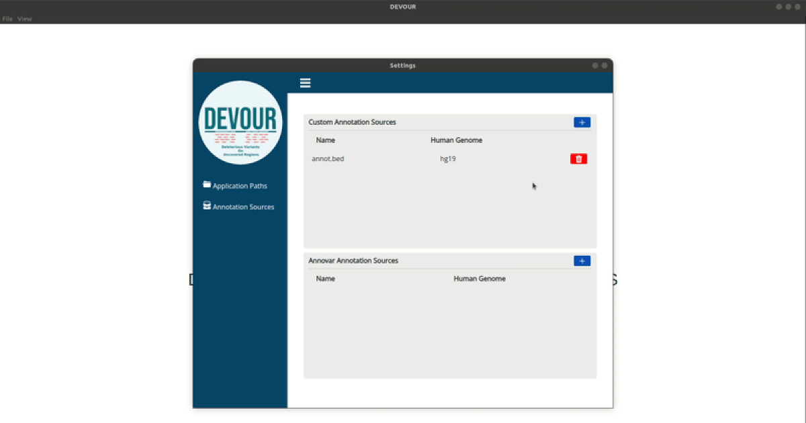
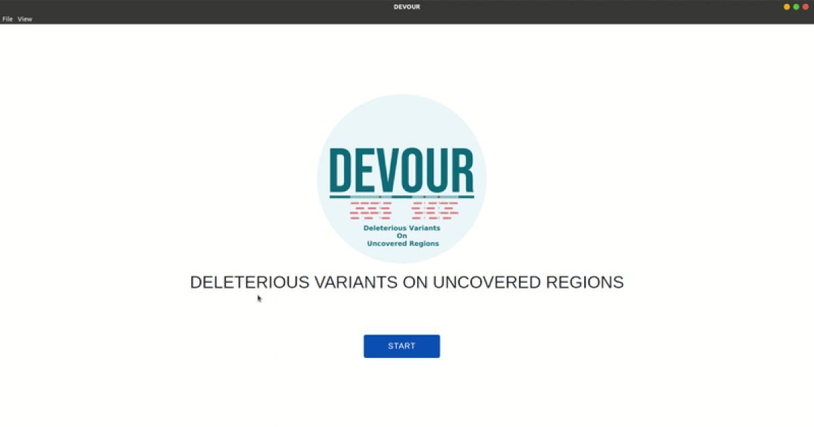
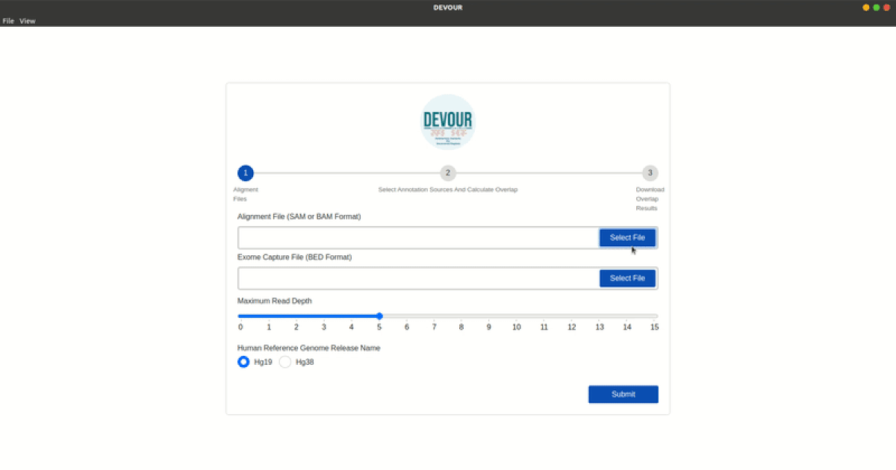
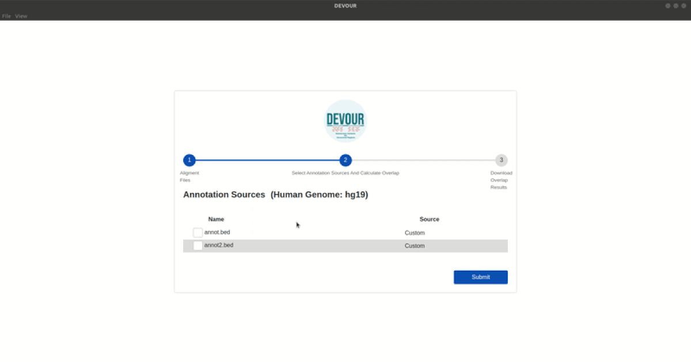
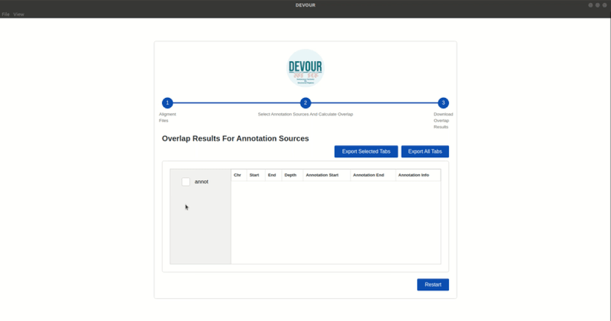
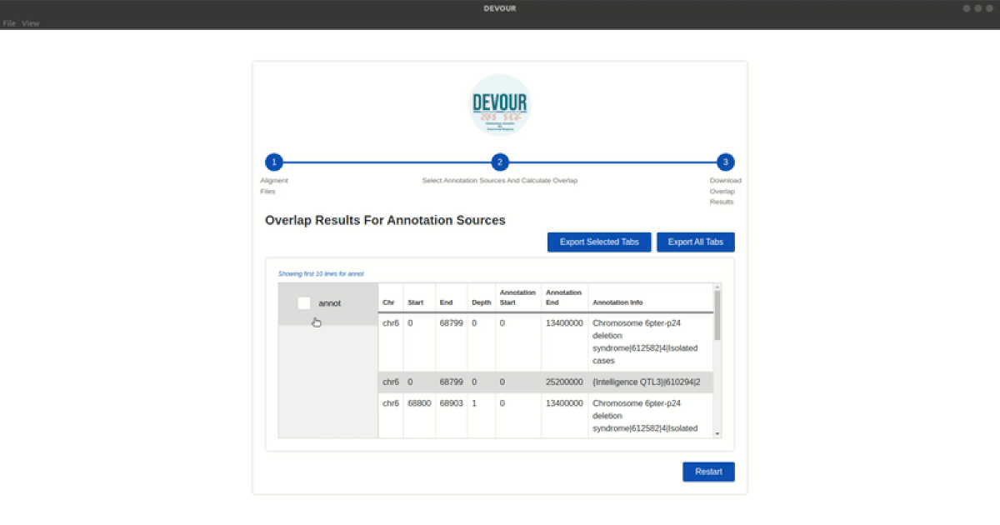
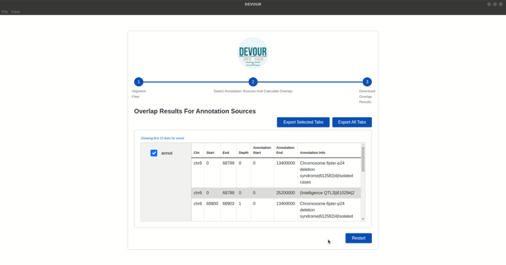

# DEVOUR (DEleterious Variants On Uncovered Regions)

<p align="center">
  
</p>

## 1-What is DEVOUR?

DEVOUR is a desktop application that identifies low-coverage regions obtained from whole-genome/exome sequencing techniques, annotates the missed variants on the uncovered regions using genetic variant annotation databases and reports those clinically important variants.

 * **DEVOUR is developed using [ElectronJS](https://www.electronjs.org/) framework**


## 2-Before Installing DEVOUR
Before installing DEVOUR the following tools needs to be installed seperately.<br/>

*It is recommended that the installations be done sequentially. And also it is recommended to install the latest versions of these tools.*
* Python3 
* Required Python libraries (intervaltree, pandas, openpxyl)
* Samtools
* Mosdepth
* ANNOVAR

### 2.1 - Python3

> Most factory versions of Linux/Ubuntu operating systems come wtih Python3 pre-installed. You can check the Python3 version by entering the following command:
> If the output says Python 3.x, Python 3 is available on your system.
```
python3 --version
```
> If you get an error message, you can use the following command to install Python3 on your system:
```
sudo apt update
sudo apt install python3.10
```
> Allow the process to complete and verify the Python3 version was installed sucessfully:
```
python3 --version
```
**NOTE:** *If you are using a different Unix distribution, you can search for installation steps suitable for your particular system.*<br/>

### 2.2 - Required Python Libraries (intervaltree, pandas, openpxyl)
> In order for the **DEVOUR** to run smoothly, some extra Python3 libraries must be installed. 
> In order to install these libraries, you can use the [**requirements.txt**](https://github.com/devourProject/Devour/releases/download/Requirements.txt/requirements.txt) file and use it as shown below:
```
pip install -r path/to/requirements.txt
```
**NOTE:** Please replace "*path/to/* " with the location where the **requirements.txt** file is located.

### 2.3 - Samtools

#### Recommended installation method

> Samtools is a widely-used suite of programs for processing high-throughput sequencing data. To install Samtools, you can access the installation guide by clicking this [link](http://www.htslib.org/download/) and perform the installation.
#### Alternative installation method:
> You can also install Samtools on Linux as shown below:
**Install updates required packages**
```
sudo apt-get update
sudo apt install gcc
sudo apt install make
```

**Install Samtools**
```
wget https://github.com/samtools/samtools/releases/download/1.9/samtools-1.9.tar.bz2
bunzip2 samtools-1.9.tar.bz2
tar -xvf samtools-1.9.tar
cd samtools-1.9
make
./samtools
```

### 2.4 Mosdepth

> Mosdepth is a command-line tool for calculating sequence coverages. The installation of Mosdepth is explained in detail on its [github page](https://github.com/brentp/mosdepth#installation).
### 2.5 ANNOVAR

> ANNOVAR is a well-known tool for functionally annotating genetic variations discovered in various genomes using up-to-date information. It is a necessary tool for DEVOUR to download and use the disease-specific variant databases.(Cosmic, Clinvar, Icgc, NCI60)
> ANNOVAR requires user registration in order to start downloading process. After filling the following registration [form](https://www.openbioinformatics.org/annovar/annovar_download_form.php), the download will start.
> You can extract the content of the downloaded file as shown below:
```
tar xzvf annovar.tar.gz
cd annovar
```
## 3-Installing DEVOUR

Currently, DEVOUR is only working on Linux environments. You can access the **debian file** required for the installation by clicking the download link below.<br/>
<br/>
[](https://github.com/projectDevour/DEVOUR/releases/download/v1.0.0/devour_1.0.0_amd64.deb)

#### Recommended installation method (Ubuntu Software Center):

> With a double click on the Debian file, you can install directly with the graphical user interface.
<p align="center">

  
</p>

#### Alternative installation method:

> DEVOUR can also be installed via command-line using **dpkg** command as shown below.
````
sudo dpkg --install [path/to/devour_1.0.0_amd64.deb]
````
**NOTE:** Please replace "*path/to/* " with the location where the **DEVOUR Debian File** file is located.

## 4-After Installing DEVOUR
After installing DEVOUR, users need to make some configurations at the first startup.

### 4.1 Configuring Application Paths

> The configuration paths of the required tools must be registered in the application.
* As stated in the figure below, users first need to set a **working directory** for the application. The folder must have already been created.
* After that, users can select the correct paths for every tool that DEVOUR requires.

<p align="center">

  
</p>

### 4.2 Creating Annotation Sources
In DEVOUR, users are able to use their own custom annotation sources as well as disease-specific variant databases provided by ANNOVAR.
Annotation sources must be either downloaded or created in order for the DEVOUR application to work properly.

> The user can create their own **custom annotation** source like shown in the figure below. Users can delete any of the annotation sources at any time.
 * **You should not use "_" when naming your custom annotation source.**
<p align="center">

  
</p>

> As indicated in the image below, the user can download any of the four disease-specific variant databases provided by **ANNOVAR** and delete the desired annotation source at any time.
<p align="center">
  
</p>

## 5-How to Use DEVOUR?
After all the configurations are done, you can start using the application.
> The application first welcomes us with a start screen. We can start the application by clicking the Start button.
<p align="center">
  
</p>

### First Step:
> On this page, user can upload an alignment file (**SAM or BAM file**) which will be processed and an exome capture file (**BED file**) for the per-base depth calculation process.
> In addition, **maximum read depth** must be determined in order to filter genomic regions with low-coverage. Finally, user needs to choose a human reference genome release name **(hg19/hg38)**.
> After all parameters are set user can click the **Submit** button. DEVOUR will automatically switch to the second step after the process is finished.
<p align="center">
  
</p>

### Second Step:

> At this step, the user is expected to select a set of **annotation sources** they want to use in their analysis. By clicking the **Submit** button the overlap calculation process will start. DEVOUR will automatically switch to the third step after the process is finished.
 **NOTE:** This step may take some time depending on the amount of annotation sources selected.

<p align="center">
  
</p>

### Third Step:

In this final step, user can preview the **overlap results** for every annotation source and export any individual result.

> As indicated in the figure below, the user can **preview** the **first 10 lines** of the result by clicking on annotation sources listed on the left side.
<p align="center">
  
</p>

> After selecting the desired result files, the user can export them in **tsv or excel** format by clicking the **Export Selected Results** or **Export All Results** buttons.
**NOTE:** Exporting results in **excel** format may take some time depending on file size.

<p align="center">
  
</p>

> After all the processes are completed, the user is guided to the startup screen by clicking the **Restart** button.
<p align="center">
  
</p>
